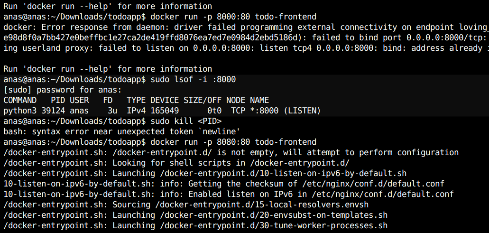
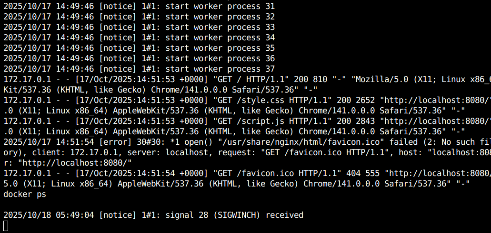
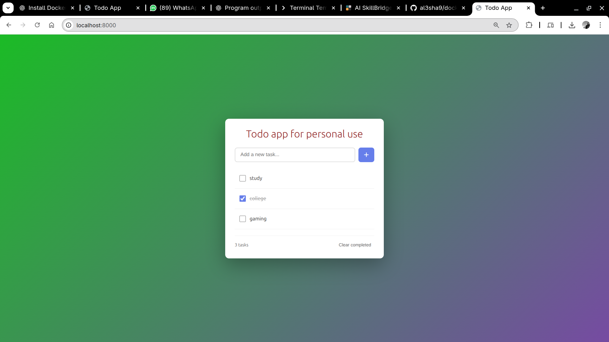

# Todo App

A minimalistic, clean todo application built with vanilla HTML, CSS, and JavaScript.

## Features

- ✨ Clean, modern minimalistic design
- ✅ Add, complete, and delete tasks
- 💾 Automatic local storage persistence
- 📱 Responsive design for mobile and desktop
- 🎨 Beautiful gradient background
- ⚡ Fast and lightweight (no frameworks required)
- 🐳 Docker containerized with docker-compose

## Screenshots

### Docker Compose Running


### Containers Status


### Application UI


## Getting Started

### Requirements

- A modern web browser (Chrome, Firefox, Safari, Edge)
- No server or build tools required (for local development)
- Docker & Docker Compose (optional, for containerized deployment)

### Running the App

#### Method 1: Docker Compose (Recommended)

Run both frontend and backend containers simultaneously:

```bash
docker-compose up -d
```

Then open:
- **Frontend**: http://localhost:8000
- **Backend API**: http://localhost:3000

For detailed Docker instructions, see [DOCKER.md](DOCKER.md).

#### Method 2: Local Development

1. **Option 1: Direct File Access**
   - Simply open `index.html` in your web browser
   - Double-click the file or right-click and select "Open with" your preferred browser

2. **Option 2: Local Server (Recommended)**
   - If you have Python installed:
     ```bash
     python3 -m http.server 8000
     ```
   - If you have Node.js installed:
     ```bash
     npx serve
     ```
   - Then open `http://localhost:8000` in your browser

## Usage

1. **Add a Task**: Type your task in the input field and press Enter or click the + button
2. **Complete a Task**: Click the checkbox next to the task
3. **Delete a Task**: Hover over a task and click the × button
4. **Clear Completed**: Click "Clear completed" to remove all completed tasks

## Data Storage

- All tasks are automatically saved to your browser's localStorage
- Tasks persist across browser sessions
- Data is stored locally on your device (not sent to any server)

## Troubleshooting

### Tasks not saving?

**Possible causes and solutions:**

1. **Private/Incognito Mode**: localStorage may be disabled in private browsing modes
   - **Fix**: Use a normal browser window instead

2. **Browser Storage Full**: localStorage has limited space (usually 5-10MB)
   - **Fix**: Clear completed tasks or browser data for this site

3. **Browser Settings**: Some browsers/extensions block localStorage
   - **Fix**: Check browser settings and disable blocking extensions

4. **File Protocol Limitations**: Some browsers restrict localStorage when opening files directly
   - **Fix**: Use a local server (see "Running the App" above)

### App not displaying correctly?

1. **Check Browser Compatibility**: Ensure you're using a modern browser
   - **Fix**: Update your browser to the latest version

2. **JavaScript Disabled**: The app requires JavaScript
   - **Fix**: Enable JavaScript in your browser settings

3. **Files Missing**: All three files must be in the same directory
   - **Fix**: Ensure `index.html`, `style.css`, and `script.js` are together

### Need to reset the app?

- Open browser Developer Tools (F12)
- Go to Console tab
- Run: `localStorage.removeItem('todos')`
- Refresh the page

## File Structure

```
todoapp/
├── index.html    # Main HTML structure
├── style.css     # Styling and design
├── script.js     # Application logic
└── README.md     # Documentation (this file)
```

## Browser Support

- Chrome/Edge: ✅ Full support
- Firefox: ✅ Full support
- Safari: ✅ Full support
- Opera: ✅ Full support
- IE11: ⚠️ May require polyfills

## License

This project is free to use and modify as you wish.

