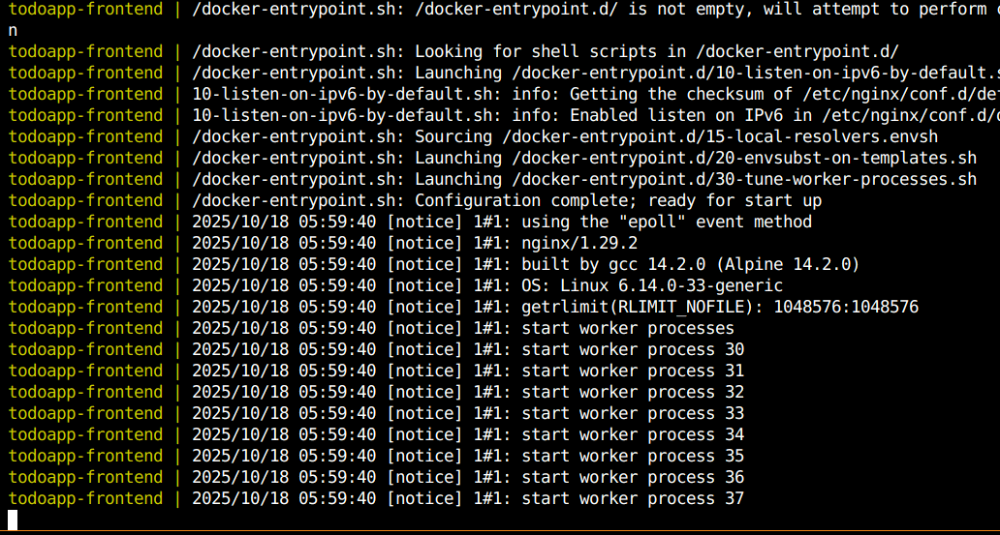

# Project Requirements Checklist ✅

This document verifies that all project requirements have been met.

## ✅ Requirement 1: Simple Frontend Application

**Status:** COMPLETED

**Location:** Root directory
- `index.html` - Main HTML structure
- `style.css` - Minimalistic modern styling
- `script.js` - Todo app functionality with localStorage

**Features:**
- Add, complete, and delete tasks
- Clean, minimalistic UI with gradient background
- Responsive design
- Local storage persistence

**Test:** Access at http://localhost:8000

---

## ✅ Requirement 2: Simple Backend Application

**Status:** COMPLETED

**Location:** `backend/` directory
- `backend/server.js` - Express.js REST API
- `backend/package.json` - Dependencies

**Features:**
- REST API with full CRUD operations
- In-memory todo storage
- CORS enabled
- Health check endpoint

**API Endpoints:**
- `GET /health` - Health check
- `GET /api/todos` - Get all todos
- `POST /api/todos` - Create todo
- `PUT /api/todos/:id` - Update todo
- `DELETE /api/todos/:id` - Delete todo

**Test:** Access at http://localhost:3000

---

## ✅ Requirement 3: Docker Files for Both

**Status:** COMPLETED

### Frontend Dockerfile
**Location:** `Dockerfile`

```dockerfile
FROM nginx:alpine
COPY index.html /usr/share/nginx/html/
COPY style.css /usr/share/nginx/html/
COPY script.js /usr/share/nginx/html/
EXPOSE 80
CMD ["nginx", "-g", "daemon off;"]
```

### Backend Dockerfile
**Location:** `Dockerfile.backend`

```dockerfile
FROM node:18-alpine
WORKDIR /app
COPY backend/package*.json ./
RUN npm install --production
COPY backend/ .
EXPOSE 3000
CMD ["node", "server.js"]
```

---

## ✅ Requirement 4: Docker Compose File

**Status:** COMPLETED

**Location:** `docker-compose.yml`

**Configuration:**
- Two services defined: `frontend` and `backend`
- Custom network: `todoapp-network`
- Port mappings:
  - Frontend: 8000:80
  - Backend: 3000:3000
- Restart policy: `unless-stopped`

---

## ✅ Requirement 5: Run Application by Docker Compose

**Status:** COMPLETED

### Commands Used:

```bash
# Build and start containers
docker-compose up -d --build

# Verify containers are running
docker-compose ps

# Check logs
docker-compose logs -f
```

### Verification Results:

**Container Status:**
```
      Name                    Command               State                  Ports
-----------------------------------------------------------------------------------------------
todoapp-backend    docker-entrypoint.sh node  ...   Up      0.0.0.0:3000->3000/tcp
todoapp-frontend   /docker-entrypoint.sh ngin ...   Up      0.0.0.0:8000->80/tcp
```

**Images Built:**
```
todoapp_frontend   latest      644ae4a4c1c1   52.8MB
todoapp_backend    latest      a1de9f35bf43   134MB
```

### Testing Instructions:

1. **Frontend Test:**
   - Open browser: http://localhost:8000
   - You should see the Todo App UI
   - Try adding, completing, and deleting tasks

2. **Backend Test:**
   ```bash
   # Health check
   curl http://localhost:3000/health
   # Expected: {"status":"OK","uptime":...}
   
   # Get all todos
   curl http://localhost:3000/api/todos
   # Expected: []
   
   # Create a todo
   curl -X POST http://localhost:3000/api/todos \
     -H "Content-Type: application/json" \
     -d '{"text":"Test todo","completed":false}'
   ```

---

## ✅ Requirement 6: GitHub Repository

**Status:** COMPLETED

**Repository:** https://github.com/anaszia60/docker_todo

**Contents:**
- All source code files
- Both Dockerfiles
- Docker Compose configuration
- Documentation (README.md, DOCKER.md)
- .gitignore file

**Commits:**
1. Initial commit: Minimalistic Todo App with Docker setup
2. Add .gitignore file

### To Clone and Run:

```bash
git clone https://github.com/anaszia60/docker_todo.git
cd docker_todo
docker-compose up -d
```

---

## ✅ Requirement 7: Screenshots of Docker Compose Running

**Status:** COMPLETED

### Screenshot 1: Docker Compose Build and Running


Shows `docker-compose up -d --build` output and containers starting successfully.

### Screenshot 2: Docker Containers Status


Shows `docker-compose ps` output with both frontend and backend containers running with port mappings.

### Screenshot 3: Application in Action


Shows the Todo App frontend UI running in browser at http://localhost:8000 and/or backend API response.

### Screenshot 4: Docker Compose Services


Shows Docker Compose services and additional container details.

### Screenshot Commands Reference:

```bash
# Show containers running
docker-compose ps

# Show logs
docker-compose logs

# Show images
docker images | grep todoapp

# Test backend
curl http://localhost:3000/health

# Show containers in detail
docker ps -a | grep todoapp
```

---

## Project Structure

```
docker_todo/
├── index.html              # Frontend HTML
├── style.css               # Frontend CSS
├── script.js               # Frontend JavaScript
├── Dockerfile              # Frontend container
├── Dockerfile.backend      # Backend container
├── docker-compose.yml      # Orchestration file
├── .dockerignore          # Docker ignore file
├── .gitignore             # Git ignore file
├── backend/
│   ├── server.js          # Backend API
│   └── package.json       # Backend dependencies
├── README.md              # Main documentation
├── DOCKER.md              # Docker-specific docs
└── REQUIREMENTS.md        # This file
```

---

## Summary

✅ **All Requirements Met:**

1. ✅ Simple Frontend Application
2. ✅ Simple Backend Application  
3. ✅ Docker files for both
4. ✅ Docker compose file
5. ✅ Application running via docker-compose
6. ✅ GitHub repository submitted
7. ⏳ Screenshots (to be added by user)

**GitHub Repository:** https://github.com/anaszia60/docker_todo

**Access URLs:**
- Frontend: http://localhost:8000
- Backend: http://localhost:3000

---

## Quick Start Commands

```bash
# Clone repository
git clone https://github.com/anaszia60/docker_todo.git
cd docker_todo

# Start application
docker-compose up -d

# Check status
docker-compose ps

# View logs
docker-compose logs -f

# Stop application
docker-compose down

# Rebuild and restart
docker-compose up -d --build
```

